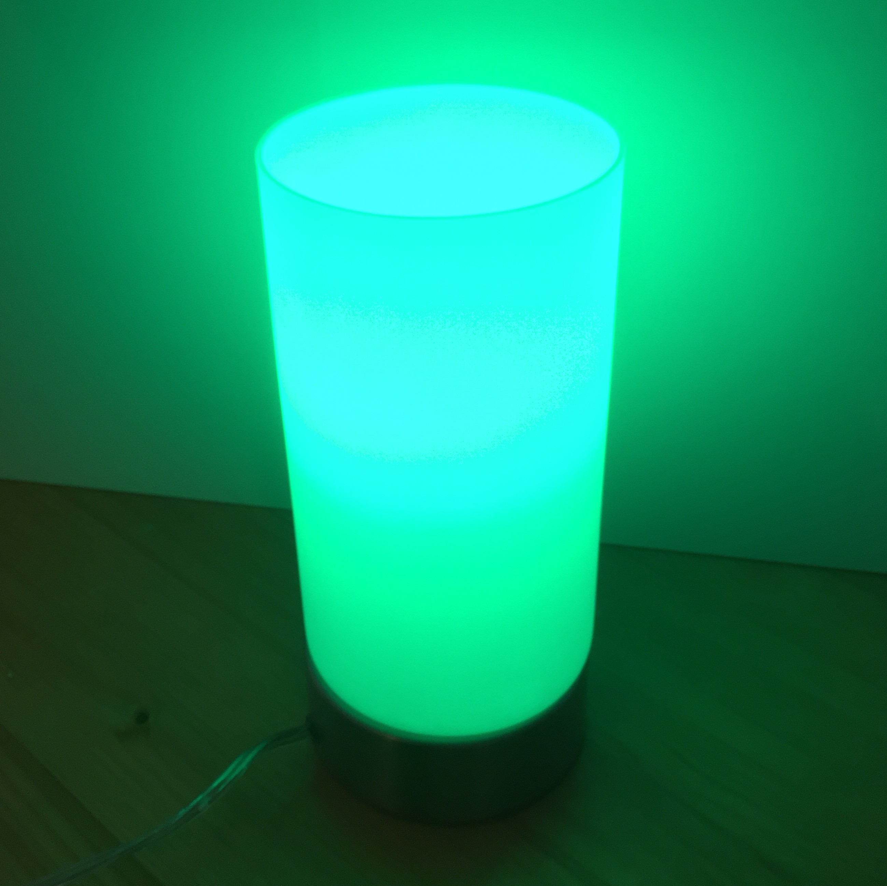
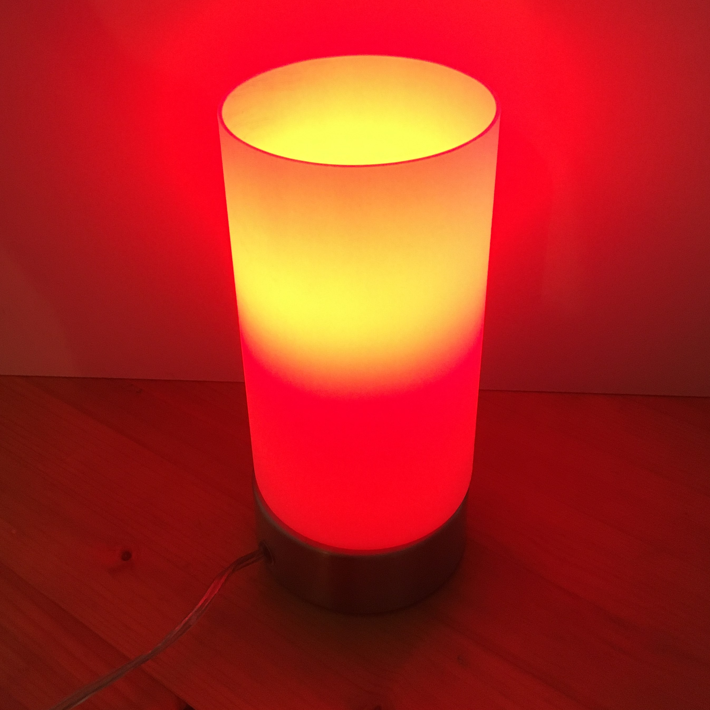
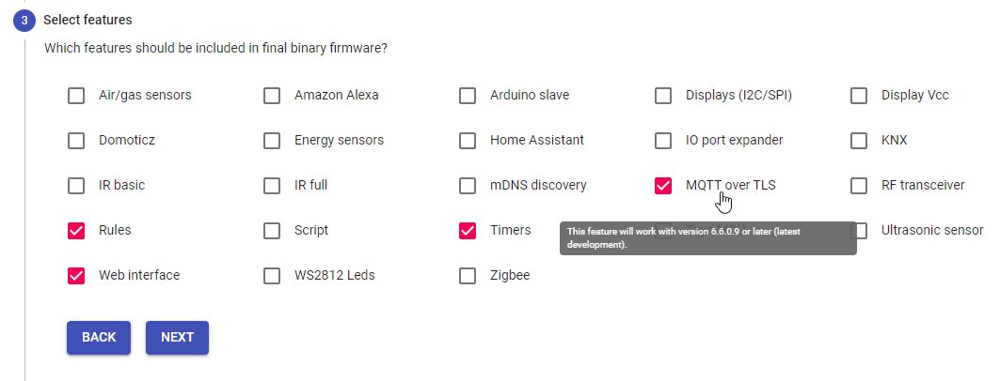
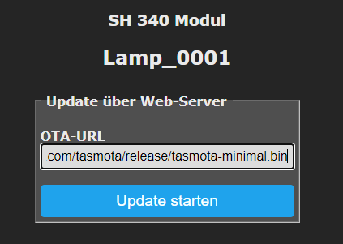
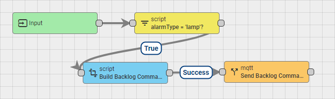

# Background
This repository documents how to use a Tasmota lamp as an CO2 indicator by controlling it via [Thingsboard](https://thingsboard.io/). Coping with the corona pandemic, these devices are used to warn employees during on-site meetings about rising carbon dioxide levels, which in turn are a reliable indicator for high aerosol exposure.

<p float="left">


</p>

# :bulb: Preperations
First of all, you need a 'smart' RGB light bulb which is supported by [Tasmota](https://tasmota.github.io/). A not necessarily complete list can be found [here](https://templates.blakadder.com/). Our prototyp is based on a [Swisstone SH 340](https://templates.blakadder.com/swisstone_SH340.html) which costs around 5-10€.

We are using a [Kali 2020.03 Live image](https://www.kali.org/downloads/) to flash the smart lights with the Tasmota firmware. Simply write the iso file to an USB stick with either `dd` or any other tool you're comfortable with. Have a look at [balenaEtcher](https://www.balena.io/etcher/) if you're looking for a reliable and simple cross-plattform application.

After booting to Kali Linux, you'll need to download [tuya-convert](https://github.com/ct-Open-Source/tuya-convert). Simply follow the documentation in the [README](https://github.com/ct-Open-Source/tuya-convert/blob/master/README.md). It's pretty straightforward and foolproof.

Assuming that you have correctly set your Wi-Fi credential, you can now connect to the WebUI by simply browsing to the IP address of your newly flashed light bulb, e.g. _http://192.168.2.80_.

The next step is to compile your own Tasmota firmware, since the standard image doesn't support secure MQTT communication via TLS. We used the foolproof and brilliant tool [TasmoCompiler](https://github.com/benzino77/tasmocompiler) from [benzino77](https://github.com/benzino77). Install docker on your Kali live system by following [this](https://www.kali.org/docs/containers/installing-docker-on-kali/) guide
and start the pre-built container with
```
docker pull benzino77/tasmocompiler
docker run --rm --name tasmocompiler -p 3000:3000 benzino77/tasmocompiler
```

Browse to http://localhost:3000 and follow the superb wizard. Make sure to check at least the feature **MQTT over TLS**.



Don't forget to download the firmware at the end of the dialog and eventually saving the configuration you have made.

In order to upload the newly built firmware to your light bulb, you need to first upload a minimal firmware since most light bulbs only provide at most 1024kB flash storage. Switch back to the WebUI of your light bulb and click on **Firmware Update**. Paste the URL http://ota.tasmota.com/tasmota/release/tasmota-minimal.bin into OTA-URL and click on **Start Update**.



Wait a moment, since your smart light will now update to the newest minimal firmware, which is completed with an automatic reboot. Browse again to the WebUI of your light bulb and click on **Firmware Update**. You can now upload your custom firmware with secure MQTT support to your smart device.

Congratulations! You now have a highly customizable light bulb which securely listens to a MQTT broker via TLS.

# Fallback Rule

In order to warn employees about either Wi-Fi or MQTT connections issues and thus not exposing outdated readings, we added the following **Rule** to the devices:

```
Rule
  ON Mqtt#Disconnected DO Color 9 ENDON
  ON Wifi#Disconnected DO Color 11 ENDON
```

 Hence, if the smart light shines purple, the bulb has lost connection to the MQTT broker.

 If on the other hand the bulb shines pink, your device has lost Wi-Fi connection.

# Thingsboard Integration

The corresponding MQTT commands are triggered by [Thingsboard](https://thingsboard.io), which can be customized with rule chains. Depending on the carbon dioxide level, the color is set accordingly. The latest JSON export of the underlying rule chain can be found [here](send_mqtt_command_to_tasmota_lamp.json) in this repository. Simply import it into your Thingsboard instance and add it to your root chain.



**Important:** Thingsboard sends the complete double quoted `msg` string to the configured MQTT topic. However, Tasmota doesn't expect command values to be quoted and hence we need to apply a little trick. We use the command [`Backlog`](https://tasmota.github.io/docs/Commands/#the-power-of-backlog) and simply seperate the first double quote with a semicolon, i.e.
```
Backlog "; Color #FF0000; Power 1; "
```
Otherwise, the [`Backlog`](https://tasmota.github.io/docs/Commands/#the-power-of-backlog) command will fail. Keep this in mind when playing around with the rule chain. Even if you're only using one single command, e.g. `Color #FF0000`, you need to send it with [`Backlog`](https://tasmota.github.io/docs/Commands/#the-power-of-backlog)!
